# 🏦 MiNi Bank — 나의 작은 미니 은행

## JAVA 개인프로젝트

> **내 손으로 구현하는 가장 작은 은행 시스템**  
> 작지만, 은행의 핵심 구조와 흐름을 그대로 담았습니다.

### 프로젝트 소개

MiNi Bank는 콘솔 기반의 **은행 시뮬레이션 프로그램**입니다.  
회원가입부터 계좌 생성, 송금, 거래내역 관리, 이벤트 보상 시스템까지  
실제 금융 서비스의 흐름을 직접 설계하고 구현하는 것을 목표로 했습니다.

### 개발 목표

- Java 기반 **OOP 객체 설계**
- **직렬화 기반 데이터 영속성** 구현 (`.ser` 저장)
- 사용자 친화적인 **예외 처리 흐름**
- 확장 가능한 구조의 **은행 서비스 아키텍처**
- 추상 클래스 기반 **이벤트 시스템(가위바위보, Up&Down)** 구축

### 한 줄 요약

> **사용자에게는 작은 금융 경험을, 개발자에게는 큰 학습 경험을 주는 미니 뱅크 프로젝트**

## 💡 Project Log (개발 일지, 트러블슈팅)

👨‍🔧전하성 개발일지

> 프로젝트 개발일지 보러가기

## ⚙️기술스택

### 언어 & 환경

### 핵심 기술

- **객체지향 프로그래밍 (OOP)**
  - 클래스 설계, 상속, 인터페이스, 캡슐화
- **예외 처리**
  - 사용자 입력 오류 대응
  - `throw` 커스텀 예외 적용 (예: 중복 ID, 잘못된 로그인, 잔액 오류)
- **컬렉션 & 자료구조**
  - `HashMap` 기반 회원/계좌 관리
  - `ArrayList` 계좌 거래기록 관리
- **파일 입출력 & 직렬화**

  - 보조 스트림(`ObjectOutputStream / ObjectInputStream`)을 활용한 데이터 직렬화
  - 프로그램 종료 후에도 회원/계좌 정보 영속적으로 유지
  - 로컬 파일(`bankdata.ser`)을 통해 상태 저장 및 복원

## MiNiBank 프로젝트 Flow

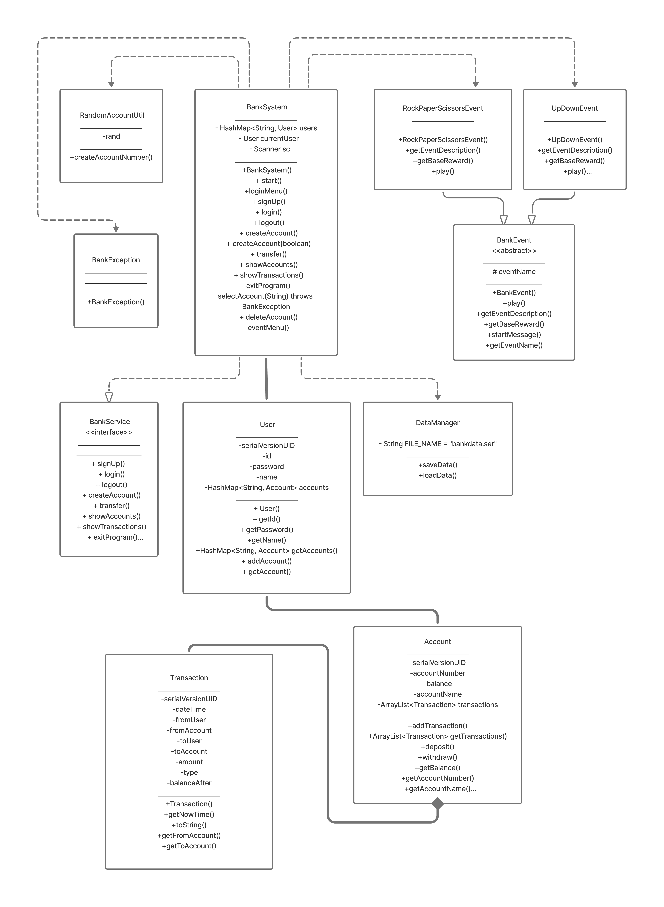

### BankSystem 객체 흐름도

- 사용자 관리: `HashMap<String, User>`
- 로그인 상태 유지: `currentUser`
- 계좌 관리: `User` 내부 `HashMap<String, Account>`
- 객체 기반 구조 + 빠른 검색 + 영속성

`BankSystem`은 사용자 정보를 `HashMap`에 저장하고,  
로그인 시 해당 `User` 객체를 `currentUser`로 유지합니다.  
또한 각 `User`는 독립적인 계좌 컬렉션을 가지고 있어

- 사용자별 계좌 분리
- 빠른 조회(O(1) 평균)
- 객체 기반 확장성 확보

를 달성했습니다.

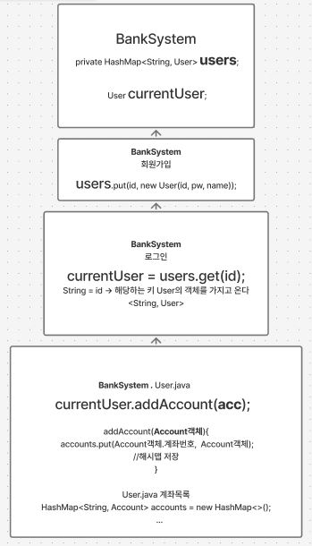

> ### 🌐 사용한 컬렉션 프레임워크

본 프로젝트에서는 계좌 및 사용자 정보를 효율적으로 관리하기 위해  
Java 컬렉션 프레임워크를 활용했습니다.

#### ✅ `HashMap<String, User>`

- **사용 목적:** 사용자(ID) 관리
- **설명:**  
  회원가입 시 ID를 Key로 하고, `User` 객체를 Value로 저장합니다.  
  이를 통해 사용자 검색 및 로그인 시 **O(1)** 평균 시간 복잡도로 빠르게 조회할 수 있습니다.

#### ✅ `HashMap<String, Account>`

- **사용 목적:** 사용자별 다중 계좌 관리
- **설명:**  
  각 `User` 객체 내부에서 계좌를 HashMap으로 보관합니다.  
  계좌번호(Key)로 Account(Value)를 매핑하여  
  **특정 계좌 조회, 삭제, 송금 처리**를 빠르게 수행합니다.

#### ✅ `ArrayList<Transaction>`

- **사용 목적:** 거래내역 순회 및 출력
- **설명:**  
  반복문을 통한 거래내역 출력 및 UI 흐름에 활용했습니다.

---

#### 🧠 설계 장점

- Key 기반 자료구조 사용으로 **빠른 검색 및 조작**
- 사용자 → 계좌 → 거래 흐름이 명확한 계층 구조
- 구조적인 설계로 **확장 및 유지보수 용이**
- 직렬화 연계로 **데이터 영속성 보장**

---

> **정리:**  
> HashMap 기반 사용자/계좌 매핑으로  
> 빠른 검색 성능과 은행 시스템에 적합한 구조를 구현했습니다.

### BankService 인터페이스 & BankSystem 구현체

은행 시스템의 기능을 `BankService` 인터페이스로 정의했습니다.  
이 방식은 **구현과 구조를 분리**하여 더 견고한 프로그램을 만들기 위해 선택했습니다.

이를 통해 프로그램이 어떤 기능을 가져야 하는지 미리 약속하고  
그 약속에 따라 `BankSystem` 클래스가 실제 동작을 구현하는 방식입니다.  
즉, 인터페이스는 **은행 기능의 설계도** 역할을 하고,  
`BankSystem`은 그 설계도를 보고 **실제로 동작하는 은행 시스템을 만든 구현체**입니다.

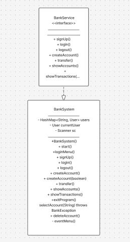

## 작동UI

> ### 🌐회원가입

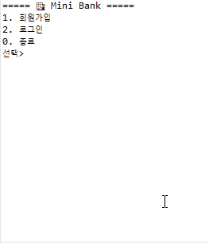

#### 회원가입 예외처리

- `BankException` 커스텀 예외 클래스 사용
- 중복 ID 입력 시 예외 발생
- 이미 존재하는 ID면 회원가입 차단
- 예외 메시지 출력 후 다시 입력 유도

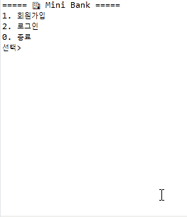

> ### 🌐로그인

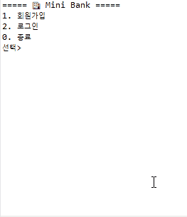

#### 로그인 예외처리

- `BankException` 커스텀 예외 클래스 사용
- 존재하지 않는 ID 입력 시 예외 발생
- 비밀번호 불일치 시 예외 발생
- 예외 메시지 출력 후 다시 입력 유도

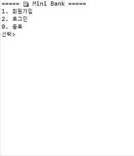
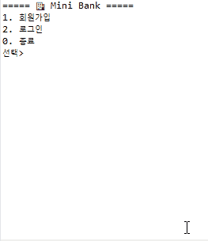

> ### 🌐계좌 추가 발급

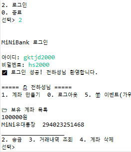

> ### 🌐송금 (내계좌)

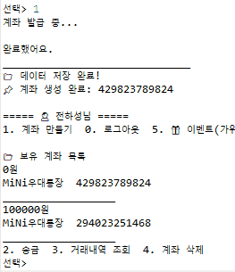

#### 송금 예외처리

- `selectAccount()` 메서드에서 throw로 던진다.
- `BankException` 커스텀 예외 클래스 사용
- 존재하지 않는 계좌 선택 시 예외 발생
- 예외 메시지 출력 후 다시 선택하도록 유도

송금 `transfer()` 기능에서도 올바르지 않은 계좌 선택 시
`selectAccount()` 메서드에서 BankException을 던지도록 했습니다.
존재하지 않는 계좌를 선택하면 예외 메시지를 출력합니다.

계좌가 없는데 삭제하려는 경우

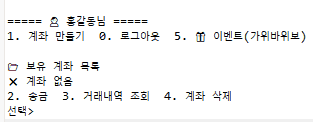

> ### 🌐거래내역

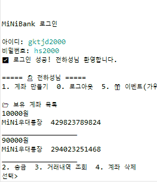

#### 거래내역 예외처리

- `selectAccount()` 메서드에서 throw로 던진다.
- `BankException` 커스텀 예외 클래스 사용
- 존재하지 않는 계좌 선택 시 예외 발생
- 예외 메시지 출력 후 다시 선택하도록 유도

거래내역 `showTransactions()` 기능에서도 올바르지 않은 계좌 선택 시
`selectAccount()` 메서드에서 BankException을 던지도록 했습니다.
존재하지 않는 계좌를 선택하면 예외 메시지를 출력합니다.

> ### 🌐계좌 삭제

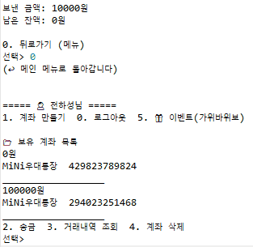

#### 계좌삭제 예외처리

- `selectAccount()` 메서드에서 throw로 던진다.
- `BankException` 커스텀 예외 클래스 사용
- 존재하지 않는 계좌 선택 시 예외 발생
- 예외 메시지 출력 후 다시 선택하도록 유도

계좌삭제`deleteAccount()` 기능에서도 올바르지 않은 계좌 선택 시
`selectAccount()` 메서드에서 BankException을 던지도록 했습니다.
존재하지 않는 계좌를 선택하면 예외 메시지를 출력합니다.

> ### 🌐다른 회원에게 송금과 / 직렬화

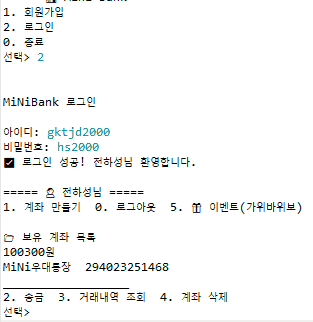

직렬화를 위해 User, Account, Transaction에 Serializable 구현

다른 회원의 계좌로 송금할 수 있습니다.  
송금 시 출금 계좌에서 잔액이 차감되고, 상대 계좌에 즉시 반영됩니다.

모든 회원 정보 및 계좌 데이터는 `HashMap`으로 관리되며,  
프로그램 종료 시 객체 직렬화(`ObjectOutputStream`)를 통해  
로컬 `.ser` 파일로 저장됩니다.

다음 실행 시 역직렬화로 데이터를 자동 복원하여  
**프로그램 종료 후에도 데이터가 유지되는 영속성** 을 제공합니다.

> ### 🌐이벤트

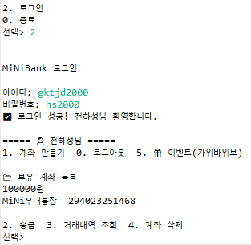

### **추상 클래스 기반 확장 구조**

> 이벤트 기능 확장을 고려하여 `BankEvent` 추상 클래스를 설계했습니다.  
> 각 이벤트는 `play()` 메서드만 구현하면 신규 게임 이벤트를 쉽게 추가할 수 있습니다.

> 공통 출력 및 기본 구조는 `BankEvent`에서 제공하여  
> 중복 코드 감소 및 **유지보수성을 향상**했습니다.

---

### **보상 처리 흐름**

게임 보상 로직은 다음과 같습니다:

- 승리 시 → **300원 입금**
- 실패 시 → **50원 입금**
- 보상 금액은 **사용자의 가장 상위 계좌**에 지급됩니다.

**Flow:**

1️⃣ 유저가 이벤트 실행  
2️⃣ `play()` 실행 → 점수(또는 결과) 반환  
3️⃣ `BankSystem`이 해당 계좌로 송금

- 입금 방식은 **MINI뱅크 송금 로직 재사용**  
  4️⃣ 거래 내역 기록

---

#### **이벤트 종류**

| 클래스                   | 설명                  |
| ------------------------ | --------------------- |
| `RockPaperScissorsEvent` | 가위바위보 보상 게임  |
| `UpDownEvent`            | 숫자 맞추기 보상 게임 |

> 신규 미니게임을 만들 때는 `BankEvent` 상속 + `play()`만 구현하면 됩니다 🎉

---

> ### 🌐로그아웃

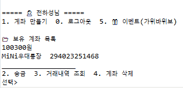

로그아웃 합니다.

## 마무리하며

기본적인 은행 기능을 객체지향적으로 구현하고
데이터 저장과 예외 처리도 적용해 본 미니 프로젝트입니다.
이번 경험을 통해 실제 서비스 구조를 더 잘 이해할 수 있었고,
작지만 보람찬 프로젝트였습니다.
